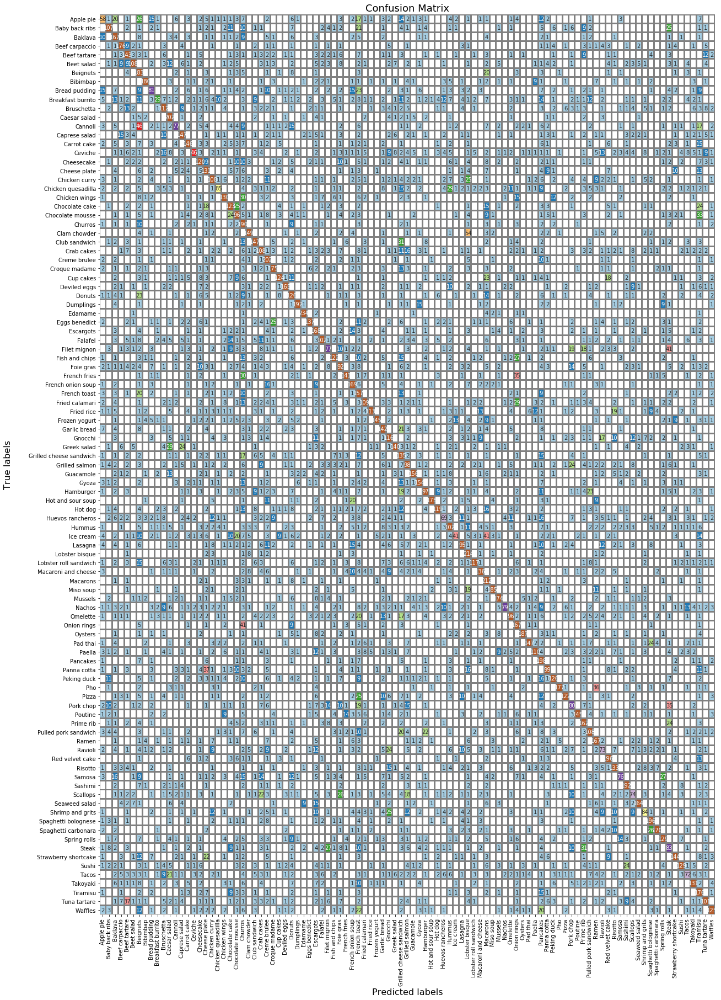

<a href="https://colab.research.google.com/github/JonSolow/foodid/blob/master/notebooks/jss_foodid.ipynb" target="_parent"></a>

# Project Overview
Question - how do we know what type of food is shown in an image?

Answers - 
1.   Memory - We have seen the food before
2.   Perspective - we know how the food is served and what other items would surround that food in a picture (ex: bowls with soup or french fries with hamburgers)

Bigger Question - How can we teach a computer/robot to identify food?

We can potentially use this information to make robot food preparers or food service bots.  It can also be used to scrape yelp photo reviews and identify restaurants by cuisine or particular dish searches.


# Mount Drive for Saving

IMPORTANT - If you run on google colab, your environment will completely reset every 12 hours (when using a GPU instance).

This is why it is useful to mount your google drive for loading and saving.  We can save checkpoint files from our model training to pick up from where we left off if we want to train for more than 12 hours.


```python
from google.colab import drive
drive.mount('/content/drive')
```

# Download Data

Data is download from the source provided at:

Food-101 – Mining Discriminative Components with Random Forests

Lukas Bossard, Matthieu Guillaumin, Luc Van Gool

https://www.vision.ee.ethz.ch/datasets_extra/food-101/


```python
!wget http://data.vision.ee.ethz.ch/cvl/food-101.tar.gz
```

    --2019-07-30 14:28:58--  http://data.vision.ee.ethz.ch/cvl/food-101.tar.gz
    Resolving data.vision.ee.ethz.ch (data.vision.ee.ethz.ch)... 129.132.52.162
    Connecting to data.vision.ee.ethz.ch (data.vision.ee.ethz.ch)|129.132.52.162|:80... connected.
    HTTP request sent, awaiting response... 302 Found
    Location: https://data.vision.ee.ethz.ch/cvl/food-101.tar.gz [following]
    --2019-07-30 14:28:58--  https://data.vision.ee.ethz.ch/cvl/food-101.tar.gz
    Connecting to data.vision.ee.ethz.ch (data.vision.ee.ethz.ch)|129.132.52.162|:443... connected.
    HTTP request sent, awaiting response... 200 OK
    Length: 4996278331 (4.7G) [application/x-gzip]
    Saving to: ‘food-101.tar.gz’
    
    food-101.tar.gz     100%[===================>]   4.65G  14.9MB/s    in 5m 3s   
    
    2019-07-30 14:34:01 (15.7 MB/s) - ‘food-101.tar.gz’ saved [4996278331/4996278331]
    


Extract the files


```python
!tar xzf food-101.tar.gz

```

## Code Imports


```python
# Add repo path to allow for importing custom functions while working on google colab
import sys
repo_path = './drive/My Drive/FoodID'
sys.path.append(repo_path)
```


```python
from functions import *
```

    Using TensorFlow backend.


# Defining Image Generators

## Pre-defined Train Test Split of Images in Dataset
The dataset authors provide a list in json format of the locations of the training and test images.


```python
img_path = './food-101/images/'
meta_path = './food-101/meta'

df_train = file_path_dataframe(os.path.join(meta_path, 'train.json'))
df_test = file_path_dataframe(os.path.join(meta_path, 'test.json'))

# Check that there are 75,750 training images and 25,250 testing images
print(df_train.shape, df_test.shape)
```

    (75750, 2) (25250, 2)


```python
# Take a peak to make sure the dataframes are correct
df_train.head()
```


<div>
<style scoped>
    .dataframe tbody tr th:only-of-type {
        vertical-align: middle;
    }

    .dataframe tbody tr th {
        vertical-align: top;
    }

    .dataframe thead th {
        text-align: right;
    }
</style>
<table border="1" class="dataframe">
  <thead>
    <tr style="text-align: right;">
      <th></th>
      <th>class</th>
      <th>filename</th>
    </tr>
  </thead>
  <tbody>
    <tr>
      <th>0</th>
      <td>churros</td>
      <td>churros/1004234.jpg</td>
    </tr>
    <tr>
      <th>1</th>
      <td>churros</td>
      <td>churros/1013460.jpg</td>
    </tr>
    <tr>
      <th>2</th>
      <td>churros</td>
      <td>churros/1016791.jpg</td>
    </tr>
    <tr>
      <th>3</th>
      <td>churros</td>
      <td>churros/102100.jpg</td>
    </tr>
    <tr>
      <th>4</th>
      <td>churros</td>
      <td>churros/1025494.jpg</td>
    </tr>
  </tbody>
</table>
</div>


```python
# Check to see that each class in the training has 750 instances and each class in testing has #250

train_class = df_train['class'].value_counts()
print(train_class.min(), train_class.max())

test_class = df_test['class'].value_counts()
print(test_class.min(), test_class.max())

```

    750 750
    250 250


## ImageDataGenerator
From the newly created dataframes, we can create a generator to provide our model with images.  The generator is a set of rules for how to load the images.

ImageDataGenerator is a great keras tool that allows us to define a pipeline for importing images (either based on a dataframe or a directory structure) without having to import and manipulate all of the images at one time.

It also allows us to manipulate the images.  In this case, we are applying random shifts of 10% of the image width and height and rotating images by up to 30 degrees in the training set.  This allows the model to become smarter by giving it images that differ in more ways. 

We also apply a rescaling by dividing the values of the image by 255 (2^8 - 1).  This produces values that range from 0 to 1.  This rescaling helps with the model and also puts the data in a format that our graphing function (imshow) can use.


```python
# create image generator and generator training and test

train_datagen = ImageDataGenerator(rescale=1./255,
                                     width_shift_range=0.1, 
                                     height_shift_range=0.1, 
                                     rotation_range=30, 
                                     horizontal_flip=True)

test_datagen = ImageDataGenerator(rescale=1./255)

data_train = train_datagen.flow_from_dataframe(
    dataframe=df_train, 
    directory='./food-101/images/', 
    x_col= 'filename', 
    y_col='class', 
    target_size=(224, 224), 
    color_mode='rgb', 
    class_mode='categorical', 
    batch_size=101, 
    shuffle=True, 
    seed=42, 
    )


data_test = test_datagen.flow_from_dataframe(
    dataframe=df_test, 
    directory='./food-101/images/', 
    x_col='filename', 
    y_col='class', 
    target_size=(224, 224), 
    color_mode='rgb', 
    class_mode='categorical', 
    batch_size=101, 
    shuffle=True, 
    seed=42, 
    )

```

    Found 75750 validated image filenames belonging to 101 classes.
    Found 25250 validated image filenames belonging to 101 classes.


## Class Labels

The class labels are provided for us in the labels.txt file.  There are several options for bringing in a text file, but numpy provides a relatively straightforward solution.  However, we must specify that the data type is a string and that the items are delimited by a new line.


```python
labels = np.loadtxt(os.path.join(meta_path, 'labels.txt'), dtype=str, delimiter='\n')

# Take a gander at the beginning and end of the list.
print('{} different classes'.format(len(labels)))
print(labels[:10])
print('...')
print(labels[-10:])
```

    101 different classes
    ['Apple pie' 'Baby back ribs' 'Baklava' 'Beef carpaccio' 'Beef tartare'
     'Beet salad' 'Beignets' 'Bibimbap' 'Bread pudding' 'Breakfast burrito']
    ...
    ['Spaghetti carbonara' 'Spring rolls' 'Steak' 'Strawberry shortcake'
     'Sushi' 'Tacos' 'Takoyaki' 'Tiramisu' 'Tuna tartare' 'Waffles']


# Random Forest Classifier

We'll take a more naive model (RandomForestClassifier) as a baseline.  This model will be very bad without performing more complicated data extractions on the images.

The model doesn't perform well because it will treat the image as an array of 150,528 numbers (224x224x3).  The meaning of the image gets lost when each pixel's amount of red, green, and blue are the only information provided.


```python
train_batches = 8
test_batches = 2

rf_train_images = []
rf_train_labels = []

rf_test_images = []
rf_test_labels = []

for _ in range(train_batches):
  tmp_img, tmp_lbl = next(data_train)
  rf_train_images.extend(tmp_img)
  rf_train_labels.extend(tmp_lbl)

for _ in range(test_batches):
  tmp_img, tmp_lbl = next(data_test)
  rf_test_images.extend(tmp_img)
  rf_test_labels.extend(tmp_lbl)

rf_train_images = [x.flatten() for x in rf_train_images]
rf_test_images = [x.flatten() for x in rf_test_images]

```


```python
rf_train_labels = np.argmax(rf_train_labels, axis=1)
rf_test_labels = np.argmax(rf_test_labels, axis=1)
```


```python
# Define the random forest model
rf_model = RandomForestClassifier(n_estimators=100, random_state=42)

# Fit the model to the training data
rf_model.fit(rf_train_images, rf_train_labels)

# Score the model based on the testing data
rf_model.score(rf_test_images, rf_test_labels)
```


    0.024752475247524754


As we can see, this model is not great.  Its accuracy of about 2.4% is only 2.4 times better than a completely random guess.


```python
# clear memory before proceeding
rf_train_images = None
rf_train_labels = None

rf_test_images = None
rf_test_labels = None
```

# CNN Convultional Neural Network

## Model Layers

The first step is to set up the actual framework of the neural network.  This network includes 5 convolutional layers.

I based this model's structure on a model produced by Adrian Rosebrock to classify images of Pokemon:
https://www.pyimagesearch.com/2018/04/16/keras-and-convolutional-neural-networks-cnns/


```python
# Define the CNN model
cnn = Sequential()
inputShape = (224, 224, 3)
chanDim = -1
classes=101

# Convultional layer takes 32 different filters of size 3x3 and scans 
# over each image which is made up of 224x224 pixels by 3 channels (RGB)
cnn.add(Conv2D(32, (3, 3), padding="same", input_shape=inputShape, activation='relu'))
# BatchNormalization avoids shifts in the distribution of the data by normalizing.
# It also makes training more efficient.
cnn.add(BatchNormalization(axis=chanDim))
# MaxPooling cuts the image size down by removing the outside of the pool size.
# In this case, the pool size is 3x3 and the image is reduced to 1/3 of original.
cnn.add(MaxPooling2D(pool_size=(3, 3)))
# Dropout layers help to avoid overfitting the model to the training data
# by randomly dropping out a percentage of the connections between layers.
cnn.add(Dropout(rate=0.25))

# Another convolution without the MaxPooling reduction and Dropout
cnn.add(Conv2D(64, (3, 3), padding="same", activation='relu'))
cnn.add(BatchNormalization(axis=chanDim))

# Another convolution similar to the first
cnn.add(Conv2D(64, (3, 3), padding="same", activation='relu'))
cnn.add(BatchNormalization(axis=chanDim))
cnn.add(MaxPooling2D(pool_size=(2, 2)))
cnn.add(Dropout(rate=0.25))

# Another convolution similar to the second
cnn.add(Conv2D(128, (3, 3), padding="same", activation='relu'))
cnn.add(BatchNormalization(axis=chanDim))

# Another convolution similar to the first
cnn.add(Conv2D(128, (3, 3), padding="same", activation='relu'))
cnn.add(BatchNormalization(axis=chanDim))
cnn.add(MaxPooling2D(pool_size=(2, 2)))
cnn.add(Dropout(rate=0.25))

# After the 5 convolutions, we Flatten the data (turn into one long array)
# The flattened data goes through a densely connected layer
# and then one more BatchNormalization and Dropout
cnn.add(Flatten())
cnn.add(Dense(1024, activation='relu'))
cnn.add(BatchNormalization())
cnn.add(Dropout(rate=0.5))

# The final layer is a Dense layer with neurons equal to the number of classes
# The activation is softmax, which provides relative probabilities 
cnn.add(Dense(classes, activation='softmax'))

```


## Model Optimizer, Loss Function, and Callbacks

The loss function and optimizer work together to adjust the weights (parameters) of the model between each batch.  The goal of the process is to minimize the loss function.

The metrics (accuracy, top-3 accuracy, and top-10 accuracy) are just gauges of how well we are doing.  They do not actually influence the results of the model, but we can use them to determine whether our model is getting better in each epoch.


```python
# Set initial learning rate for optimizer
INIT_LR = 1e-2
opt = SGD(lr=INIT_LR, momentum=0.9)

def schedule(epoch):
  if epoch<100:
    return 1e-2
  elif epoch<200:
    return 5e-3
  else:
    return 5e-4

learningrate_scheduler = LearningRateScheduler(schedule)

# Create top-10 and top-3 accuracy metrics
top10_acc = functools.partial(top_k_categorical_accuracy, k=10)
top10_acc.__name__ = 'top10_acc'

top3_acc = functools.partial(top_k_categorical_accuracy, k=3)
top3_acc.__name__ = 'top3_acc'

# Compile model with the loss, optimizer, and metrics
cnn.compile(loss="categorical_crossentropy", optimizer=opt, metrics=["accuracy", top3_acc, top10_acc])

# create checkpoint file, verbose display of saving, keep best checkpoint 
checkpoint = ModelCheckpoint(filepath='./drive/My Drive/FoodModels/modelcnn_demo.hdf5', monitor='val_acc', verbose=1, save_best_only=True)
csv_logger = CSVLogger('./drive/My Drive/FoodModels/modelcnn_demo.log')
```


The summary method of the model shows the structure, shapes, and parameters of the model.

I like to take a look before fitting to make sure everything is in order.


```python
print(cnn.summary())
```

    _________________________________________________________________
    Layer (type)                 Output Shape              Param #   
    =================================================================
    conv2d_1 (Conv2D)            (None, 224, 224, 32)      896       
    _________________________________________________________________
    batch_normalization_1 (Batch (None, 224, 224, 32)      128       
    _________________________________________________________________
    max_pooling2d_1 (MaxPooling2 (None, 74, 74, 32)        0         
    _________________________________________________________________
    dropout_1 (Dropout)          (None, 74, 74, 32)        0         
    _________________________________________________________________
    conv2d_2 (Conv2D)            (None, 74, 74, 64)        18496     
    _________________________________________________________________
    batch_normalization_2 (Batch (None, 74, 74, 64)        256       
    _________________________________________________________________
    conv2d_3 (Conv2D)            (None, 74, 74, 64)        36928     
    _________________________________________________________________
    batch_normalization_3 (Batch (None, 74, 74, 64)        256       
    _________________________________________________________________
    max_pooling2d_2 (MaxPooling2 (None, 37, 37, 64)        0         
    _________________________________________________________________
    dropout_2 (Dropout)          (None, 37, 37, 64)        0         
    _________________________________________________________________
    conv2d_4 (Conv2D)            (None, 37, 37, 128)       73856     
    _________________________________________________________________
    batch_normalization_4 (Batch (None, 37, 37, 128)       512       
    _________________________________________________________________
    conv2d_5 (Conv2D)            (None, 37, 37, 128)       147584    
    _________________________________________________________________
    batch_normalization_5 (Batch (None, 37, 37, 128)       512       
    _________________________________________________________________
    max_pooling2d_3 (MaxPooling2 (None, 18, 18, 128)       0         
    _________________________________________________________________
    dropout_3 (Dropout)          (None, 18, 18, 128)       0         
    _________________________________________________________________
    flatten_1 (Flatten)          (None, 41472)             0         
    _________________________________________________________________
    dense_1 (Dense)              (None, 1024)              42468352  
    _________________________________________________________________
    batch_normalization_6 (Batch (None, 1024)              4096      
    _________________________________________________________________
    dropout_4 (Dropout)          (None, 1024)              0         
    _________________________________________________________________
    dense_2 (Dense)              (None, 101)               103525    
    =================================================================
    Total params: 42,855,397
    Trainable params: 42,852,517
    Non-trainable params: 2,880
    _________________________________________________________________
    None


We train the model using the fit generator method.  This cool method takes the image data generators that we produced earlier and processes small batches of data.  This prevents the CPU and GPU from getting overloaded and crashing.

Because I used google colab, there were several periods of starting and stopping.  I ended up running for approximately 200 epochs, but had a few times when the environment reset and I had to pick up from a saved checkpoint. (This is why checkpoints are critical!)


```python
start_from = 0
cnn_history = cnn.fit_generator(data_train, 
                                steps_per_epoch=200,
                                epochs=200, 
                                validation_data=data_test, 
                                validation_steps=250,
                                verbose=1,
                                callbacks=[learningrate_scheduler, csv_logger, checkpoint], 
                                initial_epoch=start_from)

```

I can load the checkpoint's saved weights using the load_weights method of the model.


```python
# Load trained model weights
cnn.load_weights(filepath='./drive/My Drive/FoodModels/modelcnn_20190722.hdf5')
```

Let's see how the model does on all of the testing data.


```python
%%time
cnn.evaluate_generator(data_test, steps=250)
```

    CPU times: user 2min 1s, sys: 6.71 s, total: 2min 8s
    Wall time: 1min 55s

    [1.9335262732505798,
     0.5301782289743423,
     0.7252673327922821,
     0.8883168296813965]


Not too shabby for a model that was trained from scratch.  We got 53% accuracy on the first guess, 72% accuracy on top 3 guesses, and 89% accuracy on top 10 guesses.

This model would need some improvement to be used for food service, but for the purpose of entertainment on a website, it will do quite well.


```python
%%time
all_test_pred = []
all_test_actual = []

for i in range(250):
  sample_test_data, sample_test_labels = next(data_test)
  sample_pred = cnn.predict_classes(sample_test_data)
  all_test_pred.extend(sample_pred)
  all_test_actual.extend(sample_test_labels.argmax(axis=1))
  
```

    CPU times: user 2min 2s, sys: 7.33 s, total: 2min 9s
    Wall time: 2min 44s


A classification report tells us how well the model can predict each class.  

The precision is a measure of how many of the guesses of that class were correct.

The recall is a measure of what percentage of the actual members of a class were predicted correctly by the model.

f1-score is a harmonic mean of the other two metrics.


```python
print(classification_report(all_test_actual, all_test_pred, target_names=labels))
```

                             precision    recall  f1-score   support
    
                  Apple pie       0.34      0.23      0.27       250
             Baby back ribs       0.59      0.43      0.50       250
                    Baklava       0.44      0.67      0.53       250
             Beef carpaccio       0.69      0.70      0.70       250
               Beef tartare       0.46      0.57      0.51       250
                 Beet salad       0.69      0.43      0.53       250
                   Beignets       0.31      0.73      0.44       250
                   Bibimbap       0.85      0.72      0.78       250
              Bread pudding       0.44      0.32      0.37       250
          Breakfast burrito       0.47      0.12      0.19       250
                 Bruschetta       0.44      0.45      0.45       250
               Caesar salad       0.53      0.81      0.64       250
                    Cannoli       0.52      0.31      0.39       250
              Caprese salad       0.59      0.59      0.59       250
                Carrot cake       0.58      0.58      0.58       250
                    Ceviche       0.66      0.18      0.29       250
                 Cheesecake       0.45      0.48      0.47       250
               Cheese plate       0.39      0.52      0.44       250
              Chicken curry       0.46      0.43      0.45       250
         Chicken quesadilla       0.69      0.34      0.46       250
              Chicken wings       0.58      0.52      0.55       250
             Chocolate cake       0.44      0.49      0.46       250
           Chocolate mousse       0.34      0.38      0.36       250
                    Churros       0.29      0.76      0.42       250
               Clam chowder       0.72      0.60      0.65       250
              Club sandwich       0.57      0.59      0.58       250
                 Crab cakes       0.38      0.43      0.41       250
               Creme brulee       0.47      0.81      0.60       250
              Croque madame       0.66      0.70      0.68       250
                  Cup cakes       0.70      0.50      0.58       250
               Deviled eggs       0.82      0.66      0.73       250
                     Donuts       0.32      0.50      0.39       250
                  Dumplings       0.86      0.77      0.81       250
                    Edamame       0.89      0.94      0.91       250
              Eggs benedict       0.82      0.55      0.66       250
                  Escargots       0.42      0.67      0.52       250
                    Falafel       0.54      0.41      0.47       250
               Filet mignon       0.42      0.31      0.35       250
             Fish and chips       0.61      0.49      0.54       250
                  Foie gras       0.34      0.37      0.35       250
               French fries       0.71      0.56      0.63       250
          French onion soup       0.52      0.68      0.59       250
               French toast       0.25      0.63      0.36       250
             Fried calamari       0.56      0.44      0.49       250
                 Fried rice       0.83      0.45      0.59       250
              Frozen yogurt       0.90      0.58      0.71       250
               Garlic bread       0.46      0.57      0.51       250
                    Gnocchi       0.40      0.46      0.43       250
                Greek salad       0.76      0.56      0.64       250
    Grilled cheese sandwich       0.27      0.54      0.36       250
             Grilled salmon       0.32      0.39      0.35       250
                  Guacamole       0.78      0.62      0.69       250
                      Gyoza       0.63      0.62      0.62       250
                  Hamburger       0.49      0.39      0.43       250
          Hot and sour soup       0.94      0.70      0.80       250
                    Hot dog       0.65      0.48      0.55       250
           Huevos rancheros       0.48      0.28      0.35       250
                     Hummus       0.35      0.41      0.38       250
                  Ice cream       0.53      0.16      0.25       250
                    Lasagna       0.51      0.38      0.44       250
             Lobster bisque       0.47      0.86      0.60       250
      Lobster roll sandwich       0.74      0.47      0.57       250
        Macaroni and cheese       0.62      0.54      0.58       250
                   Macarons       0.40      0.85      0.55       250
                  Miso soup       0.87      0.74      0.80       250
                    Mussels       0.73      0.70      0.71       250
                     Nachos       0.80      0.32      0.45       250
                   Omelette       0.45      0.38      0.42       250
                Onion rings       0.45      0.67      0.54       250
                    Oysters       0.87      0.75      0.80       250
                   Pad thai       0.84      0.59      0.69       250
                     Paella       0.67      0.44      0.53       250
                   Pancakes       0.35      0.79      0.48       250
                Panna cotta       0.56      0.40      0.46       250
                Peking duck       0.63      0.50      0.56       250
                        Pho       0.93      0.71      0.80       250
                      Pizza       0.74      0.49      0.59       250
                  Pork chop       0.31      0.32      0.32       250
                    Poutine       0.94      0.58      0.72       250
                  Prime rib       0.49      0.65      0.56       250
       Pulled pork sandwich       0.46      0.43      0.44       250
                      Ramen       0.53      0.67      0.59       250
                    Ravioli       0.36      0.29      0.32       250
            Red velvet cake       0.68      0.78      0.73       250
                    Risotto       0.53      0.53      0.53       250
                     Samosa       0.57      0.30      0.40       250
                    Sashimi       0.69      0.77      0.73       250
                   Scallops       0.39      0.30      0.34       250
              Seaweed salad       0.85      0.66      0.74       250
           Shrimp and grits       0.53      0.34      0.41       250
        Spaghetti bolognese       0.63      0.78      0.70       250
        Spaghetti carbonara       0.84      0.68      0.75       250
               Spring rolls       0.58      0.52      0.55       250
                      Steak       0.27      0.33      0.30       250
       Strawberry shortcake       0.70      0.58      0.63       250
                      Sushi       0.70      0.52      0.60       250
                      Tacos       0.50      0.29      0.37       250
                   Takoyaki       0.65      0.52      0.58       250
                   Tiramisu       0.38      0.70      0.49       250
               Tuna tartare       0.55      0.40      0.47       250
                    Waffles       0.69      0.50      0.58       250
    
                   accuracy                           0.53     25250
                  macro avg       0.57      0.53      0.53     25250
               weighted avg       0.57      0.53      0.53     25250
    


A confusion matrix shows a comparison of the actual versus predicted labels.  We can see how wrong the wrong guesses were.  

For instance, when we get chocolate cake wrong, are we getting a lot of chocolate mousse guesses? (Note: this happens to be the case, which makes sense.)


```python
plot_confusion_matrix(all_test_actual, all_test_pred,  class_labels = labels, figsize=(20,30))
```





# Next steps

The next step is to save the model and apply it in a web app. I have done so using Django and Heroku at the website below:

http://grubguesser.herokuapp.com/
